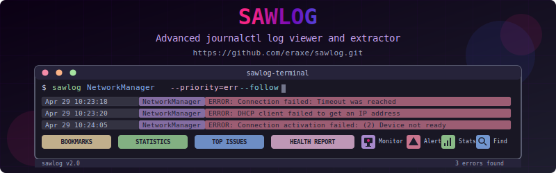

# SawLog - Advanced System Log Explorer



## The Ultimate System Log Analysis Tool

SawLog is a powerful command-line utility designed to make system log analysis easier and more insightful. Built for system administrators, DevOps engineers, and power users, SawLog wraps around journalctl to provide enhanced log viewing, filtering, and analysis capabilities.

### ✨ Key Features

- **🔍 Interactive Search**: Easily find and explore logs across system and user services
- **🚦 Smart Filtering**: Filter logs by priority, time, or pattern with intuitive syntax
- **📊 Log Statistics**: Get instant insights with statistical analysis of log patterns
- **🚨 Monitoring**: Set up automated monitoring with configurable alerts
- **🔔 Notifications**: Desktop, email and custom notifications for critical events
- **📈 Trend Analysis**: Track error and warning patterns over time
- **🔖 Bookmarks**: Save and reuse common queries
- **📋 Export**: Share findings in various formats (HTML, CSV, Markdown)
- **🧰 System Health**: Generate comprehensive system health reports

## 📋 Installation

### Quick Install

```bash
git clone https://github.com/eraxe/sawlog.git
cd sawlog
./bin/sawlog --install
```

This will install SawLog to ~/.local/bin and set up all necessary configurations.

### Requirements

- Linux system with systemd/journald
- Bash 4.0+
- The following utilities:
  - journalctl (core dependency)
  - jq (for enhanced statistics)
  - bc (for calculations)
  - Optional: notify-send/zenity/kdialog (for desktop notifications)
  - Optional: smartctl (for disk health monitoring)

## 🚀 Usage Examples

### Basic Usage

```bash
# Show the last 50 lines of NetworkManager logs
sawlog NetworkManager

# Follow SSH daemon logs, showing only errors and critical messages
sawlog -f -p err,crit sshd

# Search for "error" in kernel logs from the last hour
sawlog -k -g error -t "1 hour ago"

# View logs from multiple services at once
sawlog -m "NetworkManager systemd"
```

### Advanced Features

```bash
# Analyze system log statistics
sawlog --stats

# Show potential problem areas that need attention
sawlog --attention

# Generate a system health report
sawlog --health-report system_health.md

# Set up the monitoring service
sawlog --setup-monitor

# View error and warning trends over the past 2 weeks
sawlog --trends 14
```

### Working with Bookmarks

```bash
# Save a query as a bookmark
sawlog --bookmark "network-errors" -p err -g "fail|disconnect" NetworkManager

# Use a saved bookmark
sawlog --use network-errors

# List all bookmarks
sawlog --bookmarks
```

## 🛠️ Configuration

SawLog stores its configuration in `~/.config/sawlog/`:

- `bookmarks.conf` - Saved log queries
- `theme.conf` - Visual customization settings
- `monitor.conf` - Monitoring service configuration
- `notification.conf` - Notification settings

## 🔍 Monitoring Setup

SawLog includes a powerful monitoring service that can continuously watch your logs for issues and alert you when problems occur:

```bash
# Set up the monitoring service
sawlog --setup-monitor

# Configure notification preferences
sawlog --configure-notifications

# Disable the monitoring service
sawlog --disable-monitor
```

The monitoring service can:
- Track error rates across services
- Monitor system health metrics (CPU, memory, disk usage)
- Detect failed services
- Send alerts via multiple channels

## 🔧 Customization

SawLog can be customized to your preferences by editing the configuration files in `~/.config/sawlog/`. The theme, monitoring thresholds, notification methods, and more can all be tailored to your needs.

## 📚 Complete Documentation

For full documentation of all commands and options:

```bash
sawlog --help
```

## 📝 License

MIT License - Feel free to use, modify and distribute as needed.

---

Built with ❤️ by system administrators, for system administrators.